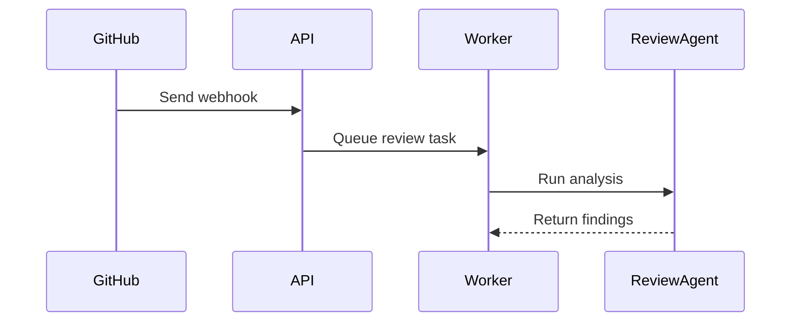

# Sequence Diagrams

```mermaid
sequenceDiagram
    participant GitHub
    participant API
    participant Worker
    participant ReviewAgent
    GitHub->>API: Send webhook
    API->>Worker: Queue review task
    Worker->>ReviewAgent: Run analysis
    ReviewAgent-->>Worker: Return findings
```
